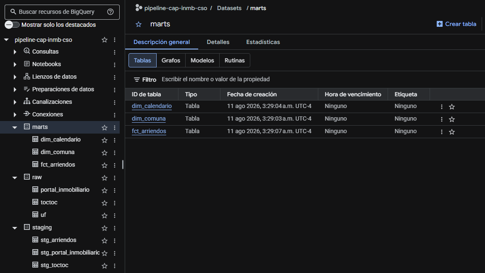
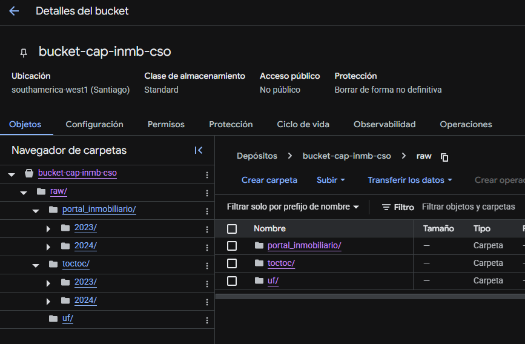
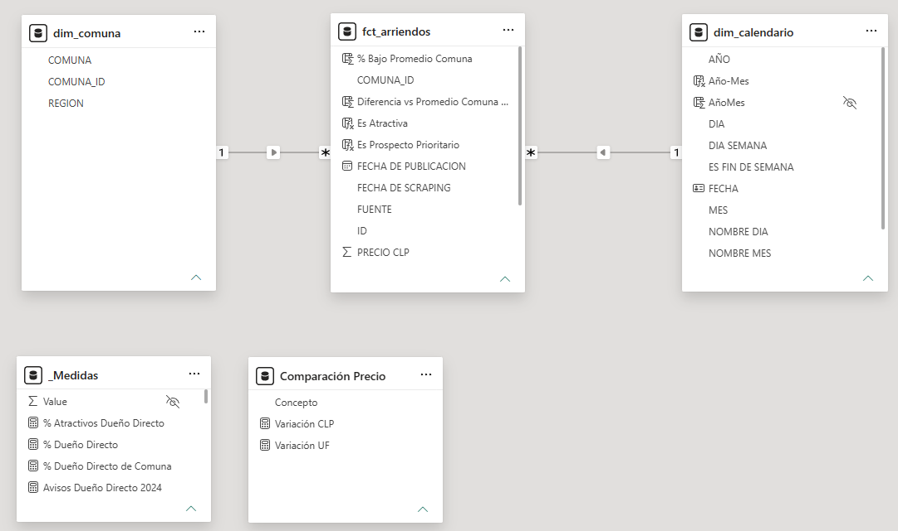
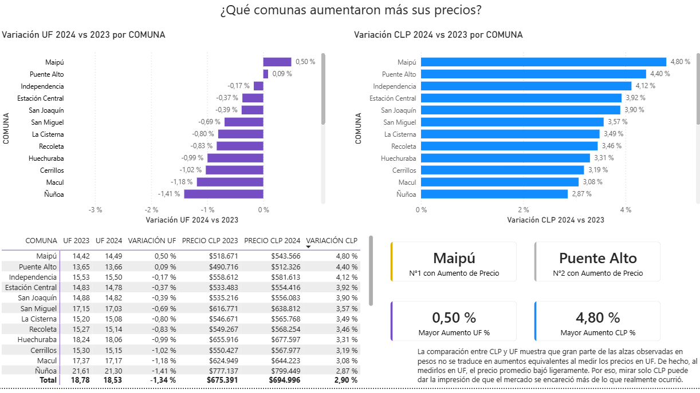
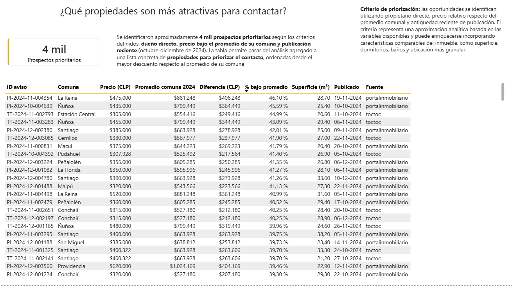

# Pipeline de Captación Inmobiliaria Chile

Pipeline de datos end-to-end desarrollado en Google Cloud Platform para procesar datos históricos de arriendo de departamentos en la Región Metropolitana de Chile.

El proyecto integra dos fuentes de publicaciones inmobiliarias, **Toctoc** y **PortalInmobiliario**, correspondientes al período 2023-2024, junto con la serie histórica oficial de la **UF**. Los datos se cargan inicialmente sin modificaciones a BigQuery y posteriormente se transforman mediante una arquitectura por capas:

**Raw → Staging → Marts → Power BI**

El resultado es un modelo analítico orientado a responder preguntas sobre evolución del mercado de arriendos, precios, oferta y oportunidades de captación de propietarios.

> [!NOTE] 
> **Nota sobre los datos:** los archivos utilizados en este proyecto son ficticios y se incluyen únicamente con fines de demostración. No representan publicaciones reales ni deben utilizarse como fuente para análisis del mercado inmobiliario chileno.

## Problema y preguntas de negocio

La información proveniente de distintas plataformas inmobiliarias presenta diferencias de estructura, calidad y representación de los precios. Para resolverlo, se construyó un pipeline que permite conservar los datos originales, aplicar transformaciones reutilizables y construir un modelo dimensional específico para el análisis.

### Mercado
- ¿Cómo evolucionó el precio de arriendo entre 2023 y 2024?
- ¿Qué comunas aumentaron más sus precios?
- ¿Cómo evolucionó el precio de arriendo por m²?
- ¿Cómo cambió la oferta de departamentos en arriendo?
- ¿Cómo cambia el análisis al utilizar UF además de CLP?

### Captación
- ¿Qué comunas son más atractivas para captar propietarios?
- ¿Dónde se concentran las mejores oportunidades de captación de propietarios directos?
- ¿Qué propiedades son más atractivas para contactar?

### Fuentes
- ¿Qué diferencias existen entre PortalInmobiliario y Toctoc?

Los criterios y supuestos específicos utilizados para responder algunas preguntas de negocio se documentan en los análisis y en el dashboard de Power BI.

## Arquitectura

```
data/raw (48 CSV + API UF) → src/ → Cloud Storage → BigQuery raw → staging → marts → Power BI
```

- **Raw es inmutable**: se carga tal cual, sin limpiar ni transformar.
- **Staging** limpia, normaliza y unifica el esquema entre las dos fuentes.
- **Marts** contiene el modelo analítico final: un fact table y dos dimensiones.
- **Power BI** consume exclusivamente `marts`.

Cada paso es idempotente: volver a ejecutarlo no duplica datos en la carga a BigQuery.




### Raw

Contiene los datos originales cargados sin transformaciones.

**Principio:** los datos en `raw` no se limpian ni corrigen.

### Staging

Contiene datos:

- limpiados;
- normalizados;
- estandarizados entre las distintas fuentes;
- preparados para ser reutilizados por futuros modelos analíticos.

En esta capa se realizan transformaciones relacionadas con calidad y consistencia de datos, sin responder todavía a una pregunta específica de negocio.

### Marts

Contiene el modelo dimensional utilizado por Power BI.

Los marts se construyen a partir de staging y contienen únicamente la población definida como analíticamente utilizable para este análisis.

Si en el futuro aparece una nueva necesidad analítica, pueden construirse nuevos marts reutilizando la capa de staging.


## Modelo de datos

### `fct_arriendos`

**Grano:** una fila por publicación inmobiliaria analíticamente utilizable.

| Columna | Descripción |
|---|---|
| `id` | Identificador de la publicación |
| `fuente` | Fuente de origen: `toctoc` o `portalinmobiliario` |
| `comuna_id` | Clave foránea hacia `dim_comuna` |
| `tipo_propiedad` | Tipo de propiedad |
| `tipo_operacion` | Tipo de operación |
| `contact_type` | Tipo de contacto del aviso |
| `superficie_m2` | Superficie de la propiedad en metros cuadrados |
| `fecha_publicacion` | Fecha original de publicación |
| `fecha_scraping` | Fecha en que la publicación fue observada/capturada |
| `precio_clp` | Precio de arriendo en pesos chilenos |
| `precio_uf` | Precio expresado en UF utilizando la serie oficial |

### `dim_comuna`

| Columna | Descripción |
|---|---|
| `comuna_id` | Identificador de la comuna |
| `comuna` | Nombre de la comuna |
| `region` | Región correspondiente |

## `dim_calendario`

Incluye:

- `fecha`
- `anio`
- `mes`
- `dia`
- `trimestre`
- `semana_anio`
- `dia_semana`
- `nombre_mes`
- `nombre_dia`
- `es_fin_de_semana`



## Stack

- Python 3.11+ (extracción y carga)
- Google Cloud Platform: Cloud Storage, BigQuery
- SQL: BigQuery Standard SQL (staging y marts)
- Power BI / DAX (consumo y visualización)
- API [mindicador.cl](https://mindicador.cl) para la serie histórica de la UF

## Estructura del repo

```text
.
├── data/raw/     48 CSV mensuales (Toctoc + PortalInmobiliario, 2023-2024)
│
├── notebooks/
│   ├── 01_exploration_toctoc.ipynb                 perfilado inicial de Toctoc        
│   ├── 02_exploration_portal_inmobiliario.ipynb    perfilado inicial de PortalInmobiliario
│   ├── 03_validate_staging.ipynb                   evidencia de las decisiones de staging
│   └── 04_validate_marts.ipynb                     evidencia de las decisiones de marts
│
├── src/
│   ├── 01_extract.py                               valida los 48 CSV + descarga la serie UF vía API
│   ├── 02_load.py                                  sube data/raw a Cloud Storage y carga BigQuery raw
│   ├── 03_run_staging.py                           ejecuta models/staging/ contra BigQuery
│   └── 04_run_marts.py                             ejecuta models/marts/ contra BigQuery
│
├── models/
│   ├── staging/
│   │   ├── stg_toctoc.sql                          limpieza y normalización de Toctoc
│   │   ├── stg_portal_inmobiliario.sql             limpieza y normalización de PortalInmobiliario
│   │   └── stg_arriendos.sql                       unión de ambas fuentes ya estandarizadas
│   └── marts/
│       ├── fct_arriendos.sql                       hecho: 1 fila por publicación analíticamente utilizable
│       ├── dim_comuna.sql                          dimensión comuna
│       └── dim_calendario.sql                      dimensión calendario (2022-01-01 a 2024-12-31)
│
├── .env.example
├── .gitignore
├── CLAUDE.md
├── requirements.txt
└── README.md
```
> [!NOTE] 
> **Nota sobre Notebooks:** Los notebooks no forman parte de la ejecución automática del pipeline. Documentan el proceso de exploración, diagnóstico y validación que llevó a las decisiones implementadas posteriormente en SQL.

## Setup

```bash
python -m venv venv
./venv/Scripts/activate
pip install -r requirements.txt
```

Copiar `.env.example` a `.env` y completar con las credenciales del proyecto:

```
GCP_PROJECT_ID=
GCS_BUCKET_NAME=
BQ_DATASET_RAW=raw
BQ_DATASET_STAGING=staging
BQ_DATASET_MARTS=marts
GOOGLE_APPLICATION_CREDENTIALS=
MINDICADOR_API_URL=https://mindicador.cl/api
```

## Ejecución del pipeline

En orden de dependencia:

```bash
python src/01_extract.py       # valida CSV + descarga serie UF
python src/02_load.py          # sube a GCS y carga BigQuery raw
python src/03_run_staging.py   # transforma raw -> staging
python src/04_run_marts.py     # transforma staging -> marts
```
Flujo:

```text
01_extract.py
    ↓
02_load.py
    ↓
BigQuery raw
    ↓
03_run_staging.py
    ↓
BigQuery staging
    ↓
04_run_marts.py
    ↓
BigQuery marts
```

## Dashboard (Power BI)

El dashboard de Power BI consume exclusivamente las tablas de la capa `marts`.

El análisis utiliza medidas DAX para responder preguntas relacionadas con:

- evolución del precio de arriendo;
- comparación entre CLP y UF;
- variación de precios entre comunas;
- precio por m²;
- evolución de la oferta;
- comparación entre las fuentes Toctoc y PortalInmobiliario.
- atractivo de comunas para captación;
- concentración de propietarios directos;
- identificación de propiedades potencialmente atractivas;

### Análisis de mercado



### Análisis de captación



> [!NOTE] 
> Todas las páginas del dashboard de Power BI se encuentran disponibles como capturas en la carpeta [`assets`](assets/).

### Preservación de datos

Los datos originales no se modifican. Las decisiones de limpieza y transformación se realizan en capas posteriores.

### Reutilización

La capa `staging` funciona como una base limpia desde la cual pueden construirse nuevos marts si aparecen nuevas preguntas de negocio.

### Reproducibilidad

Los datos ficticios utilizados para el proyecto se incluyen en el repositorio para permitir reproducir el pipeline.

## Autor

Cristóbal Sánchez Orellana — Ingeniero Civil en Computación (UTEM)
[LinkedIn](https://www.linkedin.com/in/cristobal-sanchez-orellana/) · [GitHub](https://github.com/CrisKaphiri)